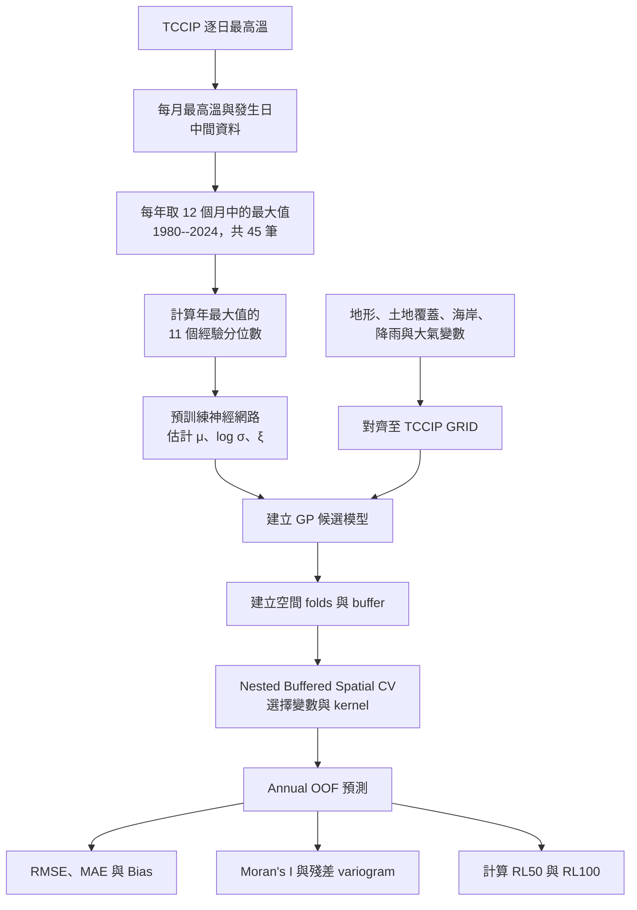

# 使用神經網路快速估計 GEV 參數

## 專案目的

本專案以 1980--2024 年的臺灣 TCCIP **年最高溫（annual block maxima）**為主要分析資料。每個 GRID 使用 45 筆年最大值計算 11 個經驗分位數，經由預訓練神經網路估計 GEV 參數，再以 Gaussian process（GP）重建空間參數曲面，最後估計 $RL_{50}$ 與 $RL_{100}$。

## 研究流程圖



## 資料與空間變數

| 類別 | 資料來源 | 處理 |
|---|---|---|
| 逐日最高溫 | TCCIP 0.05° GRID | 先建立月最高溫與發生日，再由每年 12 個月的最大值建立 45 筆年最大值 |
| 逐日降雨 | TCCIP 0.05° GRID | 降雨氣候值與極端高溫日降雨 |
| 高程 | 內政部 DTM | 高程、坡度、坡向、TPI、起伏度與崎嶇度 |
| 土地覆蓋 | ESA CCI Land Cover 2000 | 都市、森林、農業與水域的連續面積比例 |
| 海岸線 | GSHHG | GRID 中心至最近海岸距離 |
| 風速、太陽輻射、雲量 | Copernicus CDS（AgERA5） | 配對月最高溫發生日後彙整為固定的 GRID-level 候選變數；GEV response 仍為年最大值 |

年最大值由同一份逐日資料依序執行「逐日最高溫 $\rightarrow$ 月最大值 $\rightarrow$ 年最大值」得到，因此不需要假設 12 個月份彼此獨立。土地覆蓋保留連續比例，不用 `0.5` 門檻轉成單一類別。所有資料對齊至同一個 TCCIP GRID；臺灣本島座標使用 TWD97/TM2（EPSG:3826）並轉為 km。

## 現行選模邏輯

| 項目 | 設定 |
|---|---|
| Main block scale | Annual maxima，1980--2024；每個 GRID 最多 45 筆 |
| Response | NN-derived $\hat\mu$、$\widehat{\log\sigma}$、$\hat\xi$ |
| Geographic folds | Coordinate K-means，正式流程 $K=5$ |
| Spatial separation | Response-specific buffer distance |
| Training cap | 每 fold 最多 800 GRID |
| Predictor selection | Buffered Spatial-CV 內的 grouped forward feature selection |
| Collinearity | 每個 training fold 檢查 VIF，預設上限 5 |
| GP kernels | RBF、Matérn $\nu=0.5,1.5,2.5$ |
| Primary criterion | Pooled out-of-fold RMSE |
| Diagnostics | MAE、Bias、fold stability、Moran's $I$、residual variogram |
| Final quantities | $RL_{50}$ 與 $RL_{100}$ |

主要分析中的 GEV 參數與 return levels 都由年最大值估計。Predictor set 與 kernel 在相同 folds、buffer 與 training cap 下一起比較。AIC/BIC 不是空間 GP 的主要選模依據。現行結果屬開發階段；正式泛化誤差應再使用 repeated nested buffered Spatial CV。

GP 座標只減去 training-set 中心，不分別除以兩軸標準差，因此 isotropic length scale 仍以 km 表示。預設初始 length scale 為 50 km，優化範圍為 1--500 km。

## 快速開始

```powershell
uv sync
uv run python --version
```

`pyproject.toml` 與 `uv.lock` 是主要環境規格；`environment.yml` 與 `requirements.txt` 僅保留作為舊 Conda／pip 環境參考。後續指令可在前面加上 `uv run`，確保使用專案的 `.venv`。

### 1. 下載或續傳大氣資料

```powershell
python .\src\atmospheric_predictors.py --download --download-only `
  --start-year 1980 --end-year 2024 --batch-years 9
```

### 2. 檢查資料完整性

```powershell
python .\src\real_grid_modeling_pipeline.py --check-only
```

### 3. 建立 model-ready GRID，但不選模

```powershell
python .\src\real_grid_modeling_pipeline.py --prepare-only --n-jobs -2
```

### 4. 執行完整選模

```powershell
python .\src\real_grid_modeling_pipeline.py --n-jobs -2
```

### 5. $K=3,4,5,6,7$ 敏感度實驗

```powershell
python .\src\k_sensitivity_experiment.py `
  --k-values 3 4 5 6 7 --n-jobs -2
```

### 6. 輸出四階段 OOF 比較圖

```powershell
python .\src\compare_four_stage_oof.py --n-jobs -2 `
  --output-directory "C:\Users\User.DESKTOP-4RV84M1\Desktop\picture"
```

### 7. 執行 100 次 annual calibrated simulation

每次 replicate 依序生成 45 筆年最大值、執行 frozen NN、Nested Buffered Spatial CV、GP 選模與 OOF return-level 評估。完成的 replicate 會保留 checkpoint，重啟相同指令時只補跑缺少或驗證失敗的 replicate。

```powershell
uv run python .\src\calibrated_simulation_study.py `
  --block-scale annual `
  --n-replicates 100 `
  --n-jobs -2
```

## 專案結構

```text
fast_parameter_using_NN/
│
├── README.md                              
├── pyproject.toml                         # uv 主要環境規格
├── uv.lock                                # uv 鎖定版本
├── .python-version                        # Python 3.10.11
├── environment.yml                        # 舊 Conda 環境參考
├── requirements.txt                       # 舊 pip 環境參考
├── mle.R                                  # GEV 最大概似估計輔助程式
│
├── data/
│   ├── original_data/                      # TCCIP 原始日最高溫與外部原始資料
│   ├── interim/                            # 前處理過程中的暫存資料
│   ├── processed/                          # 年最大值、NN 參數與 model-ready GRID
│   ├── simulated/                          # 模擬 GEV 與空間驗證資料
│   │   └── calibrated_final_model_annual_45/
│   │       ├── replicate_000--099_annual_maxima.csv # 各次 45 筆年最大值模擬
│   │       ├── replicate_000--099_model_ready.csv # 各次模擬的 model-ready GRID
│   │       ├── nested_spatial_cv_annual/   # 各次 annual Nested OOF GP 結果
│   │       ├── simulation_replicate_metrics.csv # 每次 RMSE、MAE 與 Bias
│   │       ├── simulation_metric_summary.csv # 100 次模擬指標摘要
│   │       ├── simulation_gp_vs_nn_rmse.csv # 同 reference 的 GP-vs-NN RMSE
│   │       ├── simulation_selection_frequency.csv # predictor 與 kernel 選回率
│   │       └── simulation_time.csv         # 每次、平均與累計運算時間
│   ├── shapefile/                          # 臺灣範圍與空間邊界資料
│   └── spatial_predictors/
│       ├── raw/                            # DEM、土地覆蓋、海岸線與 AgERA5 原始檔
│       └── processed/                      # 對齊 TCCIP GRID 的候選空間變數
│
├── models/
│   ├── best_baseline_model.pth             # 原始 NN 權重
│   └── best_constraint_penalty_model.pth   # 加入 GEV constraint penalty 的 NN 權重                    
├── notebooks/
│   ├── 45annual_test.ipynb                 # 45 筆年最大值的獨立流程檢查
│   ├── constraint_penalty_comparison.ipynb # NN penalty 方法比較
│   ├── data_preprocessing.ipynb            # 真實 GRID 與候選變數前處理
│   ├── elevation_gp_model_comparison.ipynb # 無變數、高程與多變數 GP 比較
│   ├── land_cover_gp_analysis.ipynb        # 土地覆蓋變數分析
│   ├── quantile_ratio_11_quantile_analysis.ipynb # 11 分位數方法分析
│   ├── real_TCCIP_grid_data.ipynb          # Variogram、fold、buffer 與殘差診斷
│   ├── simulation.ipynb                    # Annual 校準模擬、NN、Nested Spatial CV 與恢復檢查
│   ├── spatial_predictor_selection.ipynb   # VIF、FFS、kernel 與 Spatial CV 選模
│   └── tccip_grid_preprocessing.ipynb      # TCCIP GRID 前處理結果檢查
│
├── src/
│   ├── annual_monthly_max_comparison.py    # 年／月資料與參數曲面比較
│   ├── atmospheric_predictors.py           # AgERA5 下載、解壓、事件日配對與彙整
│   ├── baseline_train.py                   # 原始 NN 訓練
│   ├── block_maxima_comparison.py          # 不同 block-maxima 定義比較
│   ├── bootstrap_nn.py                     # NN bootstrap 不確定性分析
│   ├── coast_distance_predictor.py         # GRID 至海岸距離
│   ├── compare_four_stage_oof.py           # 四階段 predictor structure OOF 比較
│   ├── compare_predictor_stage_oof.py      # 各候選變數階段 OOF 比較
│   ├── constraint_penalty_train.py         # Constraint-penalty NN 訓練
│   ├── data_preprocessing_pipeline.py      # 建立年最大值、NN 參數與 model-ready GRID
│   ├── directional_kernel_tests.py         # RBF／Matérn 空間配對檢定
│   ├── calibrated_annual_simulation.py      # 45 筆年最大值的生成、驗證與安全續跑
│   ├── calibrated_parametric_simulation.py # 依真實最終 GP 校準的情境一模擬
│   ├── calibrated_simulation_diagnostics.py # 模擬曲面 variogram 與粗糙度檢查
│   ├── calibrated_simulation_plots.py      # 模擬參數與 return-level 圖
│   ├── calibrated_simulation_spatial_cv.py # 模擬資料 Nested buffered Spatial CV
│   ├── calibrated_simulation_study.py      # 100 次 annual 模擬、彙整、重試與計時入口
│   ├── elevation_gp_analysis.py            # 高程 GP 候選模型分析
│   ├── export_spatial_selection_figures.py # 匯出選模與 OOF 圖表
│   ├── generate_nn_bootstrap_csv.py        # 整理 NN bootstrap 輸出
│   ├── generate_samples.py                 # 產生 NN 訓練樣本
│   ├── gev_nn.py                           # NN 架構與 GEV 參數轉換
│   ├── grid_search_safety_margin.py        # Constraint safety-margin 搜尋
│   ├── k_sensitivity_experiment.py        # K=3--7 的 buffered Spatial-CV 敏感度分析
│   ├── kriging_kernel_gridsearch.py        # GP kernel 與 length-scale 搜尋
│   ├── land_cover_gp_analysis.py           # 土地覆蓋 GP 分析
│   ├── land_cover_predictors.py            # 都市、森林、農業與水域比例
│   ├── plot_selected_oof_parameter_maps.py # 最終模型 OOF 參數與殘差圖
│   ├── plot_variograms.py                  # 原始與殘差 variogram 繪圖
│   ├── prepare_daily_tmax_block_maxima.py  # 日最高溫轉年／月 block maxima
│   ├── project_paths.py                    # 專案相對路徑集中管理
│   ├── quantile_ratio_estimator.py         # 11 分位數比例估計器
│   ├── rainfall_predictors.py              # 降雨氣候值與事件日降雨變數
│   ├── real_grid_modeling_pipeline.py      # 真實資料前處理與選模正式入口
│   ├── return_level_sensitivity.py         # RL 對 mu、sigma、xi 的敏感度分析
│   ├── simulate_data.py                    # 模擬 GEV 訓練資料
│   ├── simulate_spatial_gev.py             # 空間 GEV 曲面模擬
│   ├── spatial_coordinates.py              # 單一國家投影座標與 km 尺度
│   ├── spatial_diagnostics.py              # Directional／regional variogram 診斷
│   ├── spatial_predictor_selection.py      # VIF、FFS、kernel 與 buffered Spatial CV
│   ├── tccip_grid_preprocessing.py        # TCCIP GRID 清理與模擬檢查
│   ├── terrain_predictors.py               # 高程、坡度、坡向與地形起伏度
│   └── test_constraint_significance.py     # Constraint 方法的顯著性檢查
│
├── tests/
│   ├── test_prepare_daily_tmax_block_maxima.py # Block-maxima 前處理測試
│   ├── test_return_level_sensitivity.py    # RL 敏感度公式與輸出測試
│   └── test_spatial_predictor_alignment.py # 候選變數邊界與 GRID 對齊測試
│
├── results/
├── figures/                            # 程式產生的圖
├── histories/                          # NN 訓練歷史
└── tables/                             # 敏感度與統計摘要表

```

參考論文：

- **Rai et al. (2024).** *Fast parameter estimation of generalized extreme value distribution using neural networks.*  
  用途：NN 估計 GEV 參數。

- **Roberts et al. (2017).** *Cross-validation strategies for data with temporal, spatial, hierarchical, or phylogenetic structure.*  
  用途：結構化資料交叉驗證。

- **Brenning (2012).** *Spatial cross-validation and bootstrap for the assessment of prediction rules in remote sensing: The R package sperrorest.*  
  用途：空間重抽樣與分區。

- **Pohjankukka et al. (2017).** *Estimating the prediction performance of spatial models via spatial k-fold cross validation.*  
  用途：Buffered Spatial CV。

- **Valavi et al. (2019).** *blockCV: An R package for generating spatially or environmentally separated folds.*  
  用途：區塊與自相關距離。

- **Meyer et al. (2019).** *Importance of spatial predictor variable selection in machine learning applications.*  
  用途：空間預測變數選擇。

- **Snyder (1987).** *Map Projections—A Working Manual.*  
  用途：投影座標與距離換算。

- **Tibshirani, Walther, and Hastie (2001).** *Estimating the number of clusters in a data set via the gap statistic.*  
  用途：Gap statistic 選擇 K。

- **Hanel, Buishand, and Ferro (2009).** *A nonstationary index flood model for precipitation extremes in transient regional climate model simulations.*
  用途：空間 GEV 模擬設計。

## 分析範圍與後續工作

- 主要結論與模擬輸出均以 45 筆年最大值及其 annual $RL_{50}$、$RL_{100}$ 為準；不保留 monthly simulation 結果。
- 使用 100 次 annual calibrated simulation 量化 NN、Nested OOF GP 與 return-level recovery 的 RMSE、MAE、Bias、選模頻率及運算時間。
- 進一步比較 stationary 與 time-varying GEV，評估 $\mu(t)$ 或 $\log\sigma(t)$ 是否能改善時間外預測，並報告 $RL_{50}(t)$、$RL_{100}(t)$ 的不確定性。
