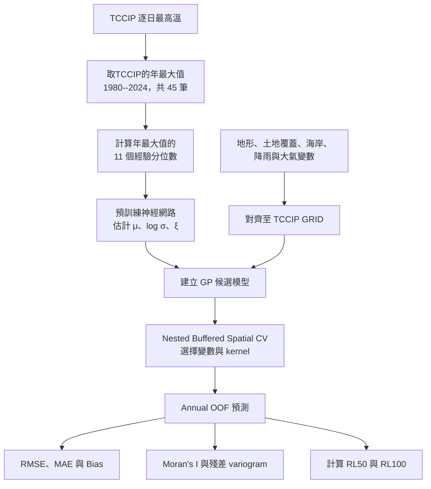
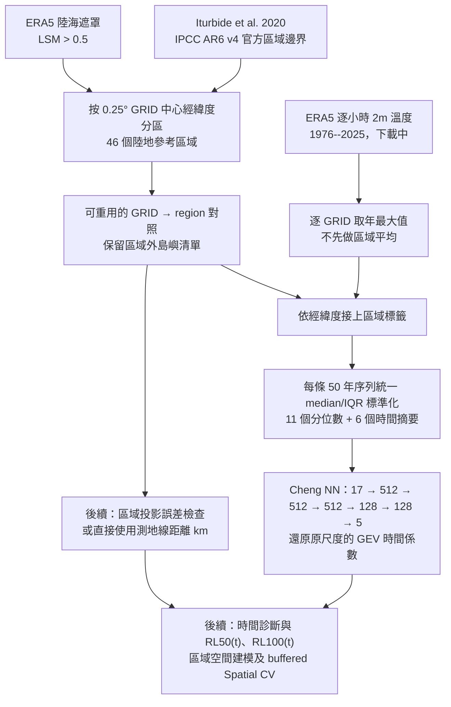

# 使用神經網路快速估計 GEV 參數

## 專案目的

本專案以 1980--2024 年的臺灣 TCCIP **年最高溫（annual block maxima）**為主要分析資料。每個 GRID 使用 45 筆年最大值計算 11 個經驗分位數，經由預訓練神經網路估計 GEV 參數，再以 Gaussian process（GP）重建空間參數曲面，最後估計 $RL_{50}$ 與 $RL_{100}$。

全球延伸版本使用 **ERA5 1976--2025 年、每格 50 筆年最大值**，目前溫度資料仍在下載。新的 Cheng NN 使用 17 維輸入（全段 11 個分位數＋早／中／晚期各一組 median、IQR），輸出 $(\mu_0,\beta_\mu,\eta_0,\beta_\sigma,\xi_0)$ 五個係數；目前固定 **10 萬組**模擬資料，train／validation／test = 8 萬／1 萬／1 萬。此分支與既有臺灣 45 年流程分開，尚不代表已完成全球 NN 或 Spatial CV 分析。舊版 NN 訓練、constraint-penalty 與 R 區間比較實驗已退役；`gev_nn.py` 和 `best_baseline_model.pth` 仍保留，供既有臺灣 annual／GP 流程推論使用。

## 研究流程圖

既有臺灣 annual 流程：


```mermaid
flowchart TD
    A["TCCIP 逐日最高溫"] --> C["取TCCIP的年最大值<br/>1980--2024，共 45 筆"]
    C --> D["計算年最大值的<br/>11 個經驗分位數"]
    D --> E["預訓練神經網路<br/>估計 μ、log σ、ξ"]

    F["地形、土地覆蓋、海岸、<br/>降雨與大氣變數"] --> G["對齊至 TCCIP GRID"]

    E --> H["建立 GP 候選模型"]
    G --> H
    H --> J["Nested Buffered Spatial CV<br/>選擇變數與 kernel"]
    J --> K["Annual OOF 預測"]

    K --> L["RMSE、MAE 與 Bias"]
    K --> M["Moran's I 與殘差 variogram"]
    K --> N["計算 RL50 與 RL100"]
```

全球延伸流程（分區可先做；溫度資料接入與區域 Spatial CV 待後續執行）：


```mermaid
flowchart TD
    R["Iturbide et al. 2020<br/>IPCC AR6 v4 官方區域邊界"] --> J["按 0.25° GRID 中心經緯度分區<br/>46 個陸地參考區域"]
    L["ERA5 陸海遮罩<br/>LSM > 0.5"] --> J
    J --> K["可重用的 GRID → region 對照<br/>保留區域外島嶼清單"]
    A["ERA5 逐小時 2m 溫度<br/>1976--2025，下載中"] --> B["逐 GRID 取年最大值<br/>不先做區域平均"]
    K --> C["依經緯度接上區域標籤"]
    B --> C
    C --> D["每條 50 年序列統一 median/IQR 標準化<br/>11 個分位數 + 6 個時間摘要"]
    D --> E["Cheng NN：17 → 512 → 512 → 512 → 128 → 128 → 5<br/>還原原尺度的 GEV 時間係數"]
    E --> F["後續：時間診斷與 RL50(t)、RL100(t)<br/>區域空間建模及 buffered Spatial CV"]
    K --> G["後續：區域投影誤差檢查<br/>或直接使用測地線距離 km"]
    G --> F
```

NN 隱藏層使用 ReLU，五維輸出為線性回歸輸出（不是 softmax）；Adam、L2 與 Dropout 比較在獨立 NN 訓練程式處理。17 維時間摘要是本專案的待驗證設計，不能把參考文獻解讀為已證明這些摘要是充分統計量。

## 資料與空間變數

| 類別 | 資料來源 | 處理 |
|---|---|---|
| 逐日最高溫 | TCCIP 0.05° GRID | 先建立月最高溫與發生日，再由每年 12 個月的最大值建立 45 筆年最大值 |
| 逐日降雨 | TCCIP 0.05° GRID | 降雨氣候值與極端高溫日降雨 |
| 高程 | 內政部 DTM | 高程、坡度、坡向、TPI、起伏度與崎嶇度 |
| 土地覆蓋 | ESA CCI Land Cover 2000 | 都市、森林、農業與水域的連續面積比例 |
| 海岸線 | GSHHG | GRID 中心至最近海岸距離 |
| 風速、太陽輻射、雲量 | Copernicus CDS（AgERA5） | 配對月最高溫發生日後彙整為固定的 GRID-level 候選變數；GEV response 仍為年最大值 |
| 全球延伸：2m 溫度 | ERA5 0.25° 全球逐小時 GRID | 1976--2025 年最大值；與臺灣 TCCIP 資料分開 |
| 全球延伸：區域邊界 | IPCC AR6 WGI v4，Iturbide et al. (2020), Fig. 1(b) | 經緯度格點中心分區，再套 ERA5 `LSM > 0.5`；不按國家邊界切割 |

年最大值由同一份逐日資料依序執行「逐日最高溫 $\rightarrow$ 月最大值 $\rightarrow$ 年最大值」得到，因此不需要假設 12 個月份彼此獨立。土地覆蓋保留連續比例，不用 `0.5` 門檻轉成單一類別。所有資料對齊至同一個 TCCIP GRID；臺灣本島座標使用 TWD97/TM2（EPSG:3826）並轉為 km。

## 現行選模邏輯

| 項目 | 設定 |
|---|---|
| Main block scale | Annual maxima，1980--2024；每個 GRID 最多 45 筆 |
| Response | NN-derived $\hat\mu$、$\widehat{\log\sigma}$、$\hat\xi$ |
| Geographic folds | Coordinate K-means，正式流程 $K=5$ |
| Spatial separation | Response-specific buffer distance |
| Training cap | 每 fold 最多 800 GRID |
| Predictor selection | Buffered Spatial-CV 內的 grouped forward feature selection |
| Collinearity | 每個 training fold 檢查 VIF，預設上限 5 |
| GP kernels | RBF、Matérn $\nu=0.5,1.5,2.5$ |
| Primary criterion | Pooled out-of-fold RMSE |
| Diagnostics | MAE、Bias、fold stability、Moran's $I$、residual variogram |
| Final quantities | $RL_{50}$ 與 $RL_{100}$ |

主要分析中的 GEV 參數與 return levels 都由年最大值估計。Predictor set 與 kernel 在相同 folds、buffer 與 training cap 下一起比較。AIC/BIC 不是空間 GP 的主要選模依據。現行結果屬開發階段；正式泛化誤差應再使用 repeated nested buffered Spatial CV。

GP 座標只減去 training-set 中心，不分別除以兩軸標準差，因此 isotropic length scale 仍以 km 表示。預設初始 length scale 為 50 km，優化範圍為 1--500 km。

以上 GP 設定屬於臺灣流程，**不能直接視為已驗證的全球設定**。AR6 是氣候參考分區，不是 Spatial CV folds，也不保證區內定常、等向性或跨區獨立。全球應先依經緯度分區，再檢查區域投影的距離誤差；buffer 可用 WGS84 測地線 km 距離。不能把 `0.25°` 當固定公里，或把 EPSG:3826 套到全球。

## 快速開始

```powershell
uv sync
uv run python --version
```

專案統一使用 uv 管理環境：`pyproject.toml` 定義依賴，`uv.lock` 鎖定版本，`.python-version` 指定 Python 版本。後續指令可在前面加上 `uv run`，確保使用專案的 `.venv`。

### 1. 下載或續傳大氣資料

```powershell
python .\src\atmospheric_predictors.py --download --download-only `
  --start-year 1980 --end-year 2024 --batch-years 9
```

### 2. 檢查資料完整性

```powershell
python .\src\real_grid_modeling_pipeline.py --check-only
```

### 3. 建立 model-ready GRID，但不選模

```powershell
python .\src\real_grid_modeling_pipeline.py --prepare-only --n-jobs -2
```

### 4. 執行完整選模

```powershell
python .\src\real_grid_modeling_pipeline.py --n-jobs -2
```

### 5. $K=3,4,5,6,7$ 敏感度實驗

```powershell
python .\src\k_sensitivity_experiment.py `
  --k-values 3 4 5 6 7 --n-jobs -2
```

### 6. 執行 100 次 annual calibrated simulation

每次 replicate 依序生成 45 筆年最大值、執行 frozen NN、Nested Buffered Spatial CV、GP 選模與 OOF return-level 評估。完成的 replicate 會保留 checkpoint，重啟相同指令時只補跑缺少或驗證失敗的 replicate。

```powershell
uv run python .\src\calibrated_simulation_study.py `
  --block-scale annual `
  --n-replicates 100 `
  --n-jobs -2
```

### 7. 預先建立全球 AR6 分區（不需要溫度下載完成）

在專案根目錄執行，或開啟 `notebooks/global_region_partition.ipynb`：

```powershell
uv run python .\src\global_climate_regions.py prepare `
  --lsm "D:\論文資料\ERA5\1975-2025_global_hourly\static\era5_land_sea_mask_global_025.nc"
```

`1975-2025_global_hourly` 是既有下載目錄名稱，**分析期間仍為 1976--2025**。此指令只在第一次下載約 0.7 MB 的官方區域邊界，不會下載溫度或重訓 NN。固定來源 commit 與 SHA-256；重跑時驗證既有輸出，損壞或未完成才重建。若更換 LSM 或門檻，請用新的 `--output-directory`，避免混用。

輸出至 `data/processed/global_regions/ar6_025/`：

- `era5_ar6_grid.nc`：721 × 1440 全域對照，包含區域 ID、LSM、陸地／分析遮罩及邊界標記。
- `region_catalogue.csv`：58 個唯一多邊形的代碼、名稱與格點數；其中 46 個支援陸地、15 個支援海洋，CAR／MED／SEA 兩者兼用。
- `land_grid_lookup.csv.gz`：`LSM > 0.5` 且位於陸地參考區的 GRID，不包含溫度。
- `land_outside_ar6_land_regions.csv`：LSM 判為陸地、但不在陸地參考區的格點（例如部分島嶼、原始邊界縫隙），並標明原因；不自動改派最近區域，也不刪原始資料。
- `ar6_land_regions.png`、`region_manifest.json`：地圖與來源／完整性紀錄。

邊界採「格點中心歸屬」而非面積占比。共用邊界以最小官方區域 ID 唯一分配；使用 $10^{-9}$ 度數值容差處理浮點邊界縫隙，**不是空間 CV buffer**。支援 0--360° 與 −180--180° 經度。全域對照保留原始極點列，但 `spatial_cv_eligible` 每個極點只保留經度 0°，避免相同位置重複進入 GP。

之後把已整理好的年最大值 CSV 接上區域（下列檔名為使用範例，需換成你的實際檔案）：

```powershell
uv run python .\src\global_climate_regions.py apply `
  --input ".\data\processed\era5_annual_maxima.csv" `
  --output ".\data\processed\era5_annual_maxima_ar6.csv" `
  --land-only
```

輸入可為每列一個 GRID-year 或每列一個 GRID 的寬表，必須有原始 `longitude`、`latitude`；不同欄名可用 `--lon-column`、`--lat-column` 指定。程式分塊讀取並保留原本溫度、年份與列順序，不按行號猜配對、不對偏離 0.25° 的位置插值，也不覆蓋輸入。可加 `--region EAS` 只輸出東亞；不加 `--land-only` 則保留全部輸入並附上篩選旗標。沒有 LSM 時可用 `prepare --without-lsm --output-directory ...` 產生純幾何模板；此時遮罩 `-1` 代表未知，不是海洋，不能執行 `--land-only`。

## 專案結構

```text
fast_parameter_using_NN/
│
├── README.md                              
├── pyproject.toml                         # uv 主要環境規格
├── uv.lock                                # uv 鎖定版本
├── .python-version                        
│
├── data/
│   ├── original_data/                      # TCCIP 原始日最高溫與外部原始資料
│   ├── interim/                            # 前處理過程中的暫存資料
│   ├── processed/                          # 年最大值、NN 參數與 model-ready GRID
│   │   └── global_regions/ar6_025/          # 全球區域對照、陸地遮罩、分區預覽與例外清單
│   ├── simulated/                          # 模擬 GEV 與空間驗證資料
│   │   ├── cheng_nn_17d/                   # 10 萬組 50 年序列；train/val/test = 8/1/1
│   │   └── calibrated_final_model_annual_45/
│   │       ├── replicate_000--099_annual_maxima.csv # 各次 45 筆年最大值模擬
│   │       ├── replicate_000--099_model_ready.csv # 各次模擬的 model-ready GRID
│   │       ├── nested_spatial_cv_annual/   # 各次 annual Nested OOF GP 結果
│   │       ├── simulation_replicate_metrics.csv # 每次 RMSE、MAE 與 Bias
│   │       ├── simulation_metric_summary.csv # 100 次模擬指標摘要
│   │       ├── simulation_gp_vs_nn_rmse.csv # 同 reference 的 GP-vs-NN RMSE
│   │       ├── simulation_selection_frequency.csv # predictor 與 kernel 選回率
│   │       └── simulation_time.csv         # 每次、平均與累計運算時間
│   ├── shapefile/                          # 臺灣範圍與空間邊界資料
│   └── spatial_predictors/
│       ├── raw/                            # DEM、土地覆蓋、海岸線與 AgERA5 原始檔
│       └── processed/                      # 對齊 TCCIP GRID 的候選空間變數
│
├── models/
│   ├── best_baseline_model.pth             # 保留：既有臺灣 annual／GP 的舊 NN 推論權重
│   ├── cheng_nn_time_varying_17d.pt         # 10 萬組 Cheng NN：無額外 L2 的基準權重
│   └── cheng_nn_time_varying_17d_l2.pt      # 10 萬組 Cheng NN：L2 版本權重
├── notebooks/
│   ├── 45annual_test.ipynb                 # 45 筆年最大值的獨立流程檢查
│   ├── cheng_NN.ipynb                      # 新 time-varying NN 架構、訓練與 RL(t) 評估
│   ├── cheng_NN_diagnostics.ipynb          # NN train/validation 診斷
│   ├── data_preprocessing.ipynb            # 真實 GRID 與候選變數前處理
│   ├── elevation_gp_model_comparison.ipynb # Annual 無 predictors／最終模型 OOF 比較
│   ├── global_region_partition.ipynb       # 先建立與檢查 AR6 分區；不需 ERA5 溫度
│   ├── grill.ipynb                         # 時間非定常 GEV 候選模型診斷
│   ├── land_cover_gp_analysis.ipynb        # 土地覆蓋變數分析
│   ├── quantile_ratio_11_quantile_analysis.ipynb # 11 分位數方法分析
│   ├── real_TCCIP_grid_data.ipynb          # Variogram、fold、buffer 與殘差診斷
│   ├── simulation.ipynb                    # Annual 校準模擬、NN、Nested Spatial CV 與恢復檢查
│   ├── spatial_predictor_selection.ipynb   # VIF、FFS、kernel 與 Spatial CV 選模
│   └── tccip_grid_preprocessing.ipynb      # TCCIP GRID 前處理結果檢查
│
├── src/
│   ├── annual_monthly_max_comparison.py    # 年／月資料與參數曲面比較
│   ├── atmospheric_predictors.py           # AgERA5 下載、解壓、事件日配對與彙整
│   ├── coast_distance_predictor.py         # GRID 至海岸距離
│   ├── data_preprocessing_pipeline.py      # 建立年最大值、NN 參數與 model-ready GRID
│   ├── directional_kernel_tests.py         # RBF／Matérn 空間配對檢定
│   ├── calibrated_annual_simulation.py      # 45 筆年最大值的生成、驗證與安全續跑
│   ├── calibrated_parametric_simulation.py # 依真實最終 GP 校準的情境一模擬
│   ├── calibrated_simulation_diagnostics.py # 模擬曲面 variogram 與粗糙度檢查
│   ├── calibrated_simulation_spatial_cv.py # 模擬資料 Nested buffered Spatial CV
│   ├── calibrated_simulation_study.py      # 100 次 annual 模擬、彙整、重試與計時入口
│   ├── cheng_nn_simulation.py              # 50 年 time-varying GEV 模擬與 17 維摘要
│   ├── train_cheng_nn.py                   # GPU 訓練入口；Adam、L2、Dropout 與早停
│   ├── cheng_nn_evaluation.py              # GEV 有效性與 RL50(t)/RL100(t) 誤差
│   ├── cheng_nn_diagnostics.py             # NN loss、參數與 RL 診斷圖
│   ├── cheng_nn_mle.py                     # Time-varying GEV 的 MLE 比較基準
│   ├── compare_cheng_nn_mle.py             # 固定 validation 案例比較 NN／MLE
│   ├── compare_cheng_nn_dropout.py         # 固定設定比較 p=0/0.1/0.2/0.5
│   ├── compare_cheng_nn_regularization.py  # 10 萬組、3 seeds；七項 RMSE、改善率與過擬合診斷
│   ├── download_global_predictors.py       # 全球 ERA5／LSM／地形／土地覆蓋／海岸下載
│   ├── global_climate_regions.py           # 官方 AR6 分區、LSM 篩選與年最大值表接合
│   ├── elevation_gp_analysis.py            # 高程 GP 候選模型分析
│   ├── export_spatial_selection_figures.py # 匯出選模與 OOF 圖表
│   ├── gev_nn.py                           # NN 架構與 GEV 參數轉換
│   ├── k_sensitivity_experiment.py        # K=3--7 的 buffered Spatial-CV 敏感度分析
│   ├── kriging_kernel_gridsearch.py        # GP kernel 與 length-scale 搜尋
│   ├── land_cover_gp_analysis.py           # 土地覆蓋 GP 分析
│   ├── land_cover_predictors.py            # 都市、森林、農業與水域比例
│   ├── plot_selected_oof_parameter_maps.py # 最終模型 OOF 參數與殘差圖
│   ├── plot_variograms.py                  # 原始與殘差 variogram 繪圖
│   ├── prepare_daily_tmax_block_maxima.py  # 日最高溫轉年／月 block maxima
│   ├── project_paths.py                    # 專案相對路徑集中管理
│   ├── quantile_ratio_estimator.py         # 11 分位數比例估計器
│   ├── rainfall_predictors.py              # 降雨氣候值與事件日降雨變數
│   ├── real_grid_modeling_pipeline.py      # 真實資料前處理與選模正式入口
│   ├── return_level_sensitivity.py         # RL 對 mu、sigma、xi 的敏感度分析
│   ├── simulate_spatial_gev.py             # 空間 GEV 曲面模擬
│   ├── spatial_coordinates.py              # 單一國家投影座標與 km 尺度
│   ├── spatial_diagnostics.py              # Directional／regional variogram 診斷
│   ├── spatial_predictor_selection.py      # VIF、FFS、kernel 與 buffered Spatial CV
│   ├── tccip_grid_preprocessing.py        # TCCIP GRID 清理與模擬檢查
│   └── terrain_predictors.py               # 高程、坡度、坡向與地形起伏度
│
├── tests/
│   ├── test_global_climate_regions.py      # 經度、邊界、遮罩、格點接合與距離測試
│   ├── test_prepare_daily_tmax_block_maxima.py # Block-maxima 前處理測試
│   ├── test_return_level_sensitivity.py    # RL 敏感度公式與輸出測試
│   └── test_spatial_predictor_alignment.py # 候選變數邊界與 GRID 對齊測試
│
└── results/
    ├── figures/                            # 程式產生的圖
    ├── histories/                          # NN 訓練歷史
    ├── tables/                             # 敏感度與統計摘要表
    └── cheng_nn_17d/                       # 新 NN 的 training、MLE 與 Dropout 比較結果

```

參考論文：

- **Iturbide et al. (2020).** *An update of IPCC climate reference regions for subcontinental analysis of climate model data: definition and aggregated datasets.* **Earth System Science Data, 12**, 2959–2970. [DOI: 10.5194/essd-12-2959-2020](https://doi.org/10.5194/essd-12-2959-2020)；[官方邊界與說明](https://github.com/SantanderMetGroup/ATLAS/tree/devel/reference-regions)。
  用途：全球分區採第 3 節、**Figure 1(b)** 的 AR6 WGI v4，兼顧氣候一致性與區域代表性；不是自動聚類，也不是區內 GEV 定常性的證明。程式固定官方邊界版本並另套 ERA5 LSM。

- **Hersbach et al. (2020).** *The ERA5 global reanalysis.* **Quarterly Journal of the Royal Meteorological Society, 146**, 1999–2049. [DOI: 10.1002/qj.3803](https://doi.org/10.1002/qj.3803)。
  用途：全球 ERA5 再分析資料來源；本文不替本專案的 GEV／NN 假設提供直接驗證。

- **Rai et al. (2024).** *Fast parameter estimation of generalized extreme value distribution using neural networks.*  
  用途：NN 估計 GEV 參數。

- **Zhou, Z., and Wu, W. B. (2009).** *Local linear quantile estimation for nonstationary time series.* **The Annals of Statistics, 37**(5B), 2696–2729. [DOI: 10.1214/08-AOS636](https://doi.org/10.1214/08-AOS636)；[公開全文](https://arxiv.org/abs/0908.3576)。
  用途：時間非定常資料的局部線性分位數估計，作為保留時間分位數資訊的方法參考；不是「全段 11 個分位數＋早／中／晚期 median 與 IQR」17 維 NN 輸入的直接驗證。該輸入設計仍須透過模擬比較估計精度與推論時間。

- **Roberts et al. (2017).** *Cross-validation strategies for data with temporal, spatial, hierarchical, or phylogenetic structure.*  
  用途：結構化資料交叉驗證。

- **Brenning (2012).** *Spatial cross-validation and bootstrap for the assessment of prediction rules in remote sensing: The R package sperrorest.*  
  用途：空間重抽樣與分區。

- **Pohjankukka et al. (2017).** *Estimating the prediction performance of spatial models via spatial k-fold cross validation.*  
  用途：Buffered Spatial CV。

- **Valavi et al. (2019).** *blockCV: An R package for generating spatially or environmentally separated folds.*  
  用途：區塊與自相關距離。

- **Meyer et al. (2019).** *Importance of spatial predictor variable selection in machine learning applications.*  
  用途：空間預測變數選擇。

- **Snyder (1987).** *Map Projections—A Working Manual.*  
  用途：投影座標與距離換算。

- **Tibshirani, Walther, and Hastie (2001).** *Estimating the number of clusters in a data set via the gap statistic.*  
  用途：Gap statistic 選擇 K。

- **Hanel, Buishand, and Ferro (2009).** *A nonstationary index flood model for precipitation extremes in transient regional climate model simulations.*
  用途：空間 GEV 模擬設計。

## 分析範圍與後續工作

- 既有臺灣主要結論與 calibrated simulation 以 45 筆年最大值及其 annual $RL_{50}$、$RL_{100}$ 為準；新的全球 NN 分支使用 50 年序列。兩者資料、模型與誤差指標不可混用；不保留 monthly simulation 結果。
- 使用 100 次 annual calibrated simulation 量化 NN、Nested OOF GP 與 return-level recovery 的 RMSE、MAE、Bias、選模頻率及運算時間。
- 進一步比較 stationary 與 time-varying GEV，評估 $\mu(t)$ 或 $\log\sigma(t)$ 是否能改善時間外預測，並報告 $RL_{50}(t)$、$RL_{100}(t)$ 的不確定性。
- 全球分區對照可先準備；正式使用前仍須完成 ERA5 年最大值完整性檢查、區域外島嶼的納入規則、區域距離與 Spatial CV 設定，以及時間／空間殘差診斷。分區本身不等於已解決洋流影響或非定常性。
